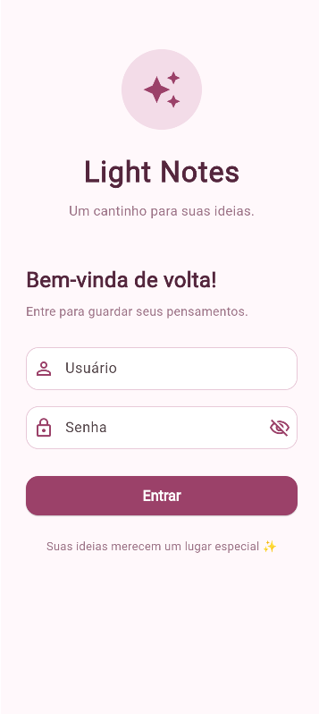
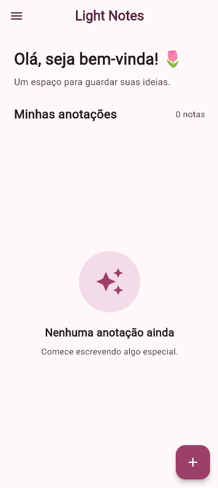
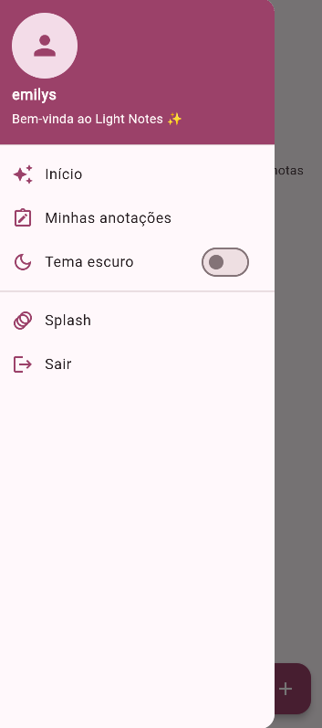
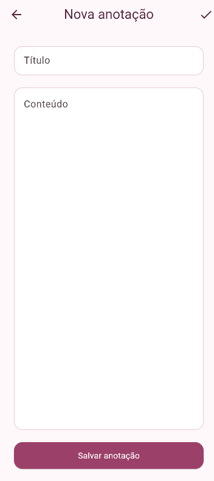

# 🌷 Light Notes

Aplicativo de bloco de anotações desenvolvido em Flutter, com uma interface feminina, bonita e intuitiva.

O Light Notes permite realizar autenticação através da API DummyJSON, criar e editar anotações, alternar entre tema claro e escuro e acessar novamente a Splash Screen através do menu lateral.

---

## 📱 Sobre o projeto

O **Light Notes** é um aplicativo de anotações desenvolvido como projeto acadêmico.

A proposta é oferecer um espaço simples e organizado para que o usuário possa registrar suas ideias e informações importantes.

O aplicativo foi desenvolvido utilizando **Flutter e Dart** e utiliza a **API DummyJSON** como autenticador do sistema.

---

## ✨ Funcionalidades

### 🔐 Autenticação

- Tela de login.
- Login utilizando a API DummyJSON.
- Validação de usuário e senha.
- Mensagem de erro caso a autenticação não seja realizada.
- Redirecionamento para a tela principal após o login.

### 🌸 Splash Screen

- Tela inicial do aplicativo.
- Animação de abertura.
- A Splash Screen também pode ser acessada novamente através do menu lateral, permitindo que a animação seja verificada mesmo depois que o aplicativo já foi iniciado.

### 📝 Anotações

- Criar novas anotações.
- Inserir título e conteúdo.
- Visualizar anotações.
- Editar anotações.
- Excluir anotações.
- Exibição da quantidade de anotações cadastradas.

### 🌙 Tema

- Tema claro.
- Tema escuro.
- Alteração do tema através do menu lateral.

### 🚪 Sair

- Opção **Sair** disponível no menu lateral.
- Ao selecionar a opção, o usuário retorna para a tela de login.
- O histórico da tela anterior é removido, impedindo o retorno à Home pelo botão voltar.

---

## 🛠️ Tecnologias utilizadas

- Flutter
- Dart
- Material Design
- HTTP
- API DummyJSON

---

## 🌐 API utilizada

O aplicativo utiliza a **DummyJSON** para realizar a autenticação.

Endpoint utilizado:

```text
https://dummyjson.com/auth/login

---
```

### Método

http
POST


### Exemplo de requisição

json
{
  "username": "emilys",
  "password": "emilyspass"
}

O aplicativo verifica a resposta da API para determinar se o usuário foi autenticado.


## 🔄 Fluxo da Aplicação

text
┌──────────────┐
│    Splash    │
└──────┬───────┘
       │
       ▼
┌──────────────┐
│    Login     │
└──────┬───────┘
       │
       ▼
┌────────────────────┐
│    DummyJSON API   │
└─────────┬──────────┘
          │
     ┌────┴────┐
     │         │
     ▼         ▼
  Sucesso     Erro
     │         │
     ▼         ▼
┌─────────┐  ┌────────────────┐
│  Home   │  │ Acesso Negado  │
└────┬────┘  └────────────────┘
     │
     ├───────────────┐
     │               │
     ▼               ▼
┌───────────┐   ┌─────────────┐
│Anotações  │   │Menu Lateral │
└─────┬─────┘   └─────────────┘
      │
      ▼
┌─────────────────┐
│ Nova Anotação + │
└─────────────────┘


---

## 📂 Estrutura do Projeto

text
light_notes/
│
├── android/
├── ios/
├── lib/
│   ├── main.dart
│   └── screens/
│       ├── splash.dart
│       ├── login.dart
│       ├── home.dart
│       └── nova_anotacao.dart
│
├── screenshots/
│   ├── tela1.png
│   ├── tela2.png
│   ├── tela2.1.png
│   └── tela3.png
│
├── pubspec.yaml
├── pubspec.lock
└── README.md

---

## 🔐 Autenticação

O processo de autenticação funciona da seguinte maneira:

1. O usuário informa seu username;
2. O usuário informa sua password;
3. O aplicativo envia os dados para a API DummyJSON;
4. A API processa as informações;
5. Se os dados estiverem corretos, a autenticação é realizada;
6. O usuário é direcionado para a Home;
7. Caso contrário, uma mensagem de *Acesso Negado* é apresentada.

---

## 👤 Usuário para Teste

A DummyJSON disponibiliza usuários para testes.

Exemplo:

text
Username: emilys
Password: emilyspass

---

## ▶️ Como Executar o Projeto

### 1. Clonar o repositório

bash
git clone https://github.com/SEU-USUARIO/SEU-REPOSITORIO.git


### 2. Entrar na pasta

bash
cd SEU-REPOSITORIO


### 3. Instalar as dependências

bash
flutter pub get


### 4. Executar o aplicativo

bash
flutter run


---

## 📸 Telas do Aplicativo

### Login



### Home



### Barra Lateral



### Nova Anotação




---

## 📚 O que foi aprendido

Durante o desenvolvimento desta atividade foram praticados conceitos como:

* Criação de interfaces;
* Navegação entre telas;
* Animações;
* Formulários;
* Validação de campos;
* Requisições HTTP;
* Consumo de API REST;
* Envio de dados em JSON;
* Autenticação através de API;
* Tratamento de erros;
* Organização de projetos Flutter;
* Utilização do Git e GitHub.

---

## 👨‍💻 Autor

*Lívia Mazzolini Guarizo*

Projeto desenvolvido para fins acadêmicos como atividade prática de desenvolvimento mobile e consumo de API.

---

## 📄 Licença

Este projeto foi desenvolvido para fins *educacionais e acadêmicos*.
